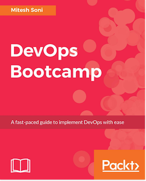

[](https://gitpitch.com/enogrob/ebook-devops-bootcamp/master?grs=github&t=moon)
```
Roberto Nogueira  
BSd EE, MSd CE
Solution Integrator Experienced - Certified by Ericsson
```
# eBook Devops BootCamp



**About**

Learn everything you need to about the subject of this `eBook` project.

[Homepage](https://www.packtpub.com/networking-and-servers/devops-bootcamp)

## Topics
```
1: DEVOPS CONCEPTS AND ASSESSMENT FRAMEWORK
[x] Need for DevOps
[x] How can DevOps culture evolve?
[x] Importance of PPT - people, process, and technology
[x] Why DevOps is not all about tools
[x] DevOps assessment questions
[x] Summary
2: CONTINUOUS INTEGRATION
[ ] Installing Jenkins 2
[ ] Creating and configuring Maven-based JEE web applications
[ ] Integrating Jenkins and SonarQube
[ ] E-mail notifications in Jenkins
[ ] Continuous integration using Visual Studio Team Services
[ ] Summary
3: CONTAINERS
[ ] Overview of Docker containers
[ ] Understanding the difference between virtual machines and containers
[ ] Installing and configuring Docker
[ ] Creating a Tomcat container
[ ] Summary
4: CLOUD COMPUTING AND CONFIGURATION MANAGEMENT
[ ] An overview of the Chef configuration management tool
[ ] Installing and configuring a Chef workstation
[ ] Installing knife plugins for Amazon Web Services and Microsoft Azure
[ ] Summary
5: CONTINUOUS DELIVERY
[ ] Continuous delivery in Docker container using Jenkins Plugin
[ ] Continuous Delivery in AWS EC2 and Microsoft Azure VM using Script
[ ] Continuous delivery in AWS Elastic Beanstalk using Jenkins Plugin
[ ] Continuous delivery in Microsoft Azure App Services Using FTP
[ ] Continuous delivery in Microsoft Azure App Services Using VSTS
[ ] Summary
6: AUTOMATED TESTING (FUNCTIONAL AND LOAD TESTING)
[ ] Functional testing using Selenium
[ ] Load testing using a URL-based test and Apache JMeter for Microsoft Azure
[ ] Summary
7: ORCHESTRATION - END-TO-END AUTOMATION
[ ] End-to-end automation of application life cycle management using Jenkins
[ ] End-to-end automation using Jenkins, Chef, and AWS EC2
[ ] End-to-end automation using Jenkins and AWS Elastic Beanstalk
[ ] End-to end aautomation using Jenkins and Microsoft Azure app services
[ ] End-to-end automation orchestration of application life cycle management using VSTS
[ ] Summary
8: SECURITY AND MONITORING
[ ] Security in Jenkins and VSTS
[ ] User management in Jenkins
[ ] Monitoring Jenkins and Microsoft Azure
[ ] Summary
```
